# Nistula Unified Guest Messaging Backend

A FastAPI backend for receiving guest messages from multiple channels, normalizing them into a single internal schema, generating AI-assisted draft replies with Claude, and routing each response through a confidence-based safety decision.

This project was built for the Nistula technical assessment, but the implementation is intentionally written like a small production service rather than a throwaway demo. The core focus is not only "can the API return a reply?" but also:

- What happens when the AI provider fails?
- Which messages are safe to auto-send?
- Which messages need human review?
- How can another engineer understand and extend the system quickly?
- How do we preserve operational safety in a hospitality context?

## What This System Does

The backend exposes a single webhook endpoint:

```http
POST /webhook/message
```

It accepts guest messages from:

- WhatsApp
- Booking.com
- Airbnb
- Instagram
- Direct channels

Each inbound payload is validated, classified, normalized, passed through a Claude-backed reply generator, scored for confidence, and routed to one of three operational actions:

| Action | Meaning |
| :-- | :-- |
| `auto_send` | Safe enough to send without human review |
| `agent_review` | Useful draft, but a human should verify it |
| `escalate` | High-risk or low-confidence message requiring urgent attention |

The API response intentionally stays small and assignment-aligned:

```json
{
  "message_id": "uuid",
  "query_type": "pre_sales_availability",
  "drafted_reply": "Hi Rahul! Great news...",
  "confidence_score": 0.91,
  "action": "auto_send"
}
```

Internal details such as AI failure types, fallback reasons, and routing diagnostics are kept in logs, not exposed in the public API contract.

## Why This Is More Than a Basic Webhook

Guest messaging is operationally sensitive. A bad response can create real work for the hospitality team, frustrate a guest, or accidentally promise something the business cannot honor.

The system therefore treats AI output as helpful but not authoritative. Claude can draft replies, but the backend owns:

- input validation
- query classification
- property context control
- fallback behavior
- confidence scoring
- escalation decisions
- observability

That separation is deliberate. It keeps the service useful when Claude works, and safe when Claude is unavailable, rate-limited, misconfigured, or returns malformed output.

## Architecture Overview

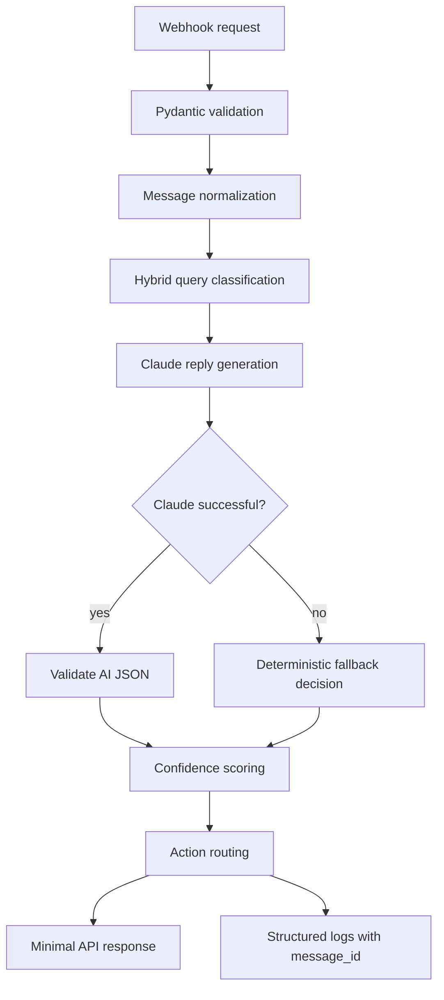

### Request Lifecycle

1. Validate the incoming payload with Pydantic.
2. Classify the message using fast deterministic rules.
3. Normalize it into the unified internal schema.
4. Send the normalized message and property context to Claude.
5. Validate the AI response before trusting it.
6. If Claude fails, attempt deterministic factual fallback only when safe.
7. Score the response using business-risk-aware confidence logic.
8. Return the drafted reply and routing action.
9. Log the full decision path using the generated `message_id`.

## Tech Stack

| Layer | Technology |
| :-- | :-- |
| API framework | FastAPI |
| Validation | Pydantic |
| AI provider | Anthropic Claude API |
| Environment config | `python-dotenv`, `pydantic-settings` |
| Test harness | `httpx`, async Python scripts |
| Database design | PostgreSQL schema in `schema.sql` |

## Project Structure

```text
nistula-technical-assessment/
  app/
    config/
      constants.py
      settings.py
    models/
      message.py
    routes/
      webhook.py
    schemas/
      message.py
    services/
      classifier.py
      claude.py
      fallback.py
      scorer.py
    main.py
  screenshots/
  tests/
    sample_requests.py
    test_fallback.py
  schema.sql
  thinking.md
  requirements.txt
  .env.example
  README.md
```

## API Documentation

FastAPI automatically generates interactive Swagger documentation at:

```text
http://127.0.0.1:8000/docs
```

This is useful for manually trying the webhook, inspecting request and response schemas, and confirming that internal debug fields are not part of the public API contract.

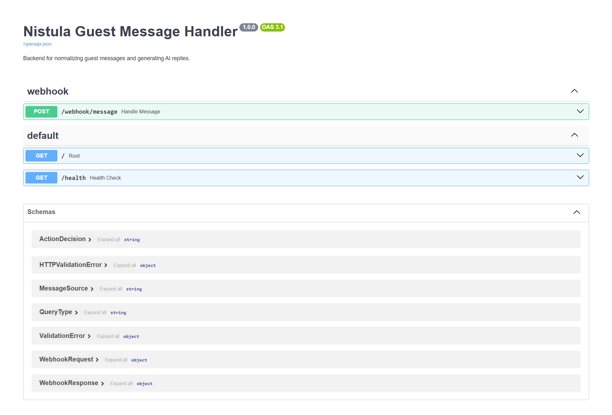

## Setup and Local Development

### Prerequisites

- Python 3.11 or newer
- `pip`
- A terminal or PowerShell
- An Anthropic API key for live Claude calls

The system still runs without a working Claude balance because it includes graceful fallback handling. A low-credit or expired key will produce logged AI failures, but the API should continue returning safe responses.

### 1. Clone or Open the Project

```bash
git clone https://github.com/Black-Coffee-Ramen/nistula-technical-assessment.git
cd nistula-technical-assessment
```

If you are running on macOS or Linux, use the equivalent path where the project is stored.

### 2. Create a Virtual Environment

Windows PowerShell:

```powershell
python -m venv .venv
.\.venv\Scripts\Activate.ps1
```

macOS or Linux:

```bash
python -m venv .venv
source .venv/bin/activate
```

### 3. Install Dependencies

```bash
pip install -r requirements.txt
```

### 4. Configure Environment Variables

Create a `.env` file in the project root:

```env
ANTHROPIC_API_KEY=your_anthropic_key_here
PORT=8000
DEBUG=True
```

Do not commit `.env`. The repository includes `.env.example` for reference and `.gitignore` excludes real environment files.

### 5. Start the FastAPI Server

```bash
uvicorn app.main:app --reload
```

Expected output:

```text
Uvicorn running on http://127.0.0.1:8000
Application startup complete.
```

### 6. Check Health and Docs

Open:

```text
http://127.0.0.1:8000/health
http://127.0.0.1:8000/docs
```

The health endpoint should return:

```json
{
  "status": "healthy"
}
```

### 7. Run the Automated Validation Suite

Keep the FastAPI server running in one terminal. In a second terminal:

```bash
python tests/sample_requests.py
```

The script sends many realistic payloads to `/webhook/message`, prints each request result, and summarizes routing behavior. It covers:

- factual operational questions
- availability and pricing
- complaints
- refund language
- mixed-intent messages
- typos and short messages
- invalid property IDs
- missing fields
- invalid timestamps
- concurrent requests

For fallback-focused checks:

```bash
$env:PYTHONPATH="."; python tests/test_fallback.py
```

On macOS or Linux:

```bash
PYTHONPATH=. python tests/test_fallback.py
```

### Troubleshooting

| Symptom | Likely cause | What to do |
| :-- | :-- | :-- |
| `ModuleNotFoundError: No module named 'app'` | Running a test directly without project root on `PYTHONPATH` | Run from project root with `PYTHONPATH=.` |
| `Your credit balance is too low` | Anthropic key is valid enough to reach the API, but has no credits | This is handled gracefully; use deterministic fallback demos |
| `401 authentication_error` | Invalid or missing API key | Check `.env` and restart the server |
| `404 Property 'villa-x9' not found` | Unsupported property ID | Expected behavior; only `villa-b1` is implemented |
| Empty message returns `422` | Pydantic validation | Expected behavior |

## Example Request

```json
{
  "source": "whatsapp",
  "guest_name": "Rahul Sharma",
  "message": "Is the villa available from April 20 to 24? What is the rate for 2 adults?",
  "timestamp": "2026-05-05T10:30:00Z",
  "booking_ref": "NIS-2024-0891",
  "property_id": "villa-b1"
}
```

## Unified Message Schema

Before the message is sent into the AI pipeline, the webhook normalizes it into an internal shape:

```json
{
  "message_id": "generated UUID",
  "source": "whatsapp",
  "guest_name": "Rahul Sharma",
  "message_text": "Is the villa available from April 20 to 24?",
  "timestamp": "2026-05-05T10:30:00Z",
  "booking_ref": "NIS-2024-0891",
  "property_id": "villa-b1",
  "query_type": "pre_sales_availability"
}
```

This keeps downstream services independent from channel-specific webhook naming. The rest of the pipeline works with `message_text`, not raw channel payload fields.

## Query Classification

The classifier maps inbound messages into the six required query types:

| Query type | Example |
| :-- | :-- |
| `pre_sales_availability` | "Is the villa available on these dates?" |
| `pre_sales_pricing` | "What is the rate for 2 adults?" |
| `post_sales_checkin` | "What time can we check in? What is the WiFi password?" |
| `special_request` | "Can we arrange airport pickup?" |
| `complaint` | "The AC is not working. This is unacceptable." |
| `general_enquiry` | "Do you allow pets? Is parking available?" |

The first pass is deterministic keyword classification. This is faster, cheaper, and safer for obvious intents such as complaints, WiFi requests, and check-in questions. Claude is used for drafting and for ambiguity handling, but the backend does not depend on Claude to recognize every critical operational risk.

### Mixed-Intent Handling

Some guest messages contain more than one intent:

```text
Can we check in early and what is the WiFi password?
```

The WiFi portion is factual and safe. The early check-in portion depends on availability and operations. The system treats this as mixed intent and avoids blindly auto-sending a partial answer.

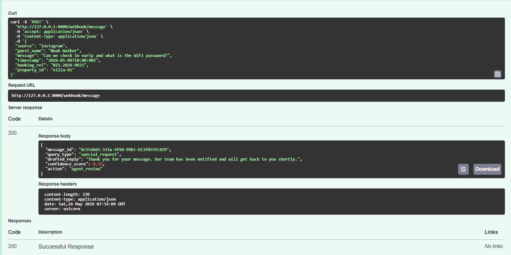

That behavior is intentional. A useful system should not answer the easy half of a message while ignoring the part that needs staff confirmation.

## Claude Integration

The Claude service is responsible for:

- building the hospitality prompt
- injecting Villa B1 property context
- calling `claude-sonnet-4-20250514`
- requesting a structured JSON response
- validating the returned JSON
- categorizing expected API failures
- returning a safe internal failure object when needed

The prompt includes the property context from the brief:

```text
Property: Villa B1, Assagao, North Goa
Bedrooms: 3
Max guests: 6
Private pool: Yes
Check-in: 2pm
Check-out: 11am
Base rate: INR 18,000 per night (up to 4 guests)
Extra guest: INR 2,000 per night per person
WiFi password: Nistula@2024
Caretaker: Available 8am to 10pm
Chef on call: Yes, pre-booking required
Availability April 20-24: Available
Cancellation: Free up to 7 days before check-in
```

If Claude returns malformed JSON or omits `drafted_reply`, the backend rejects that AI response and falls back to a safe path. This prevents invalid AI output from breaking the public response schema.

## Graceful Degradation

The most important production lesson in this project is that AI availability is not guaranteed. During testing, Anthropic responded with a low-credit billing error. The code treats that as an expected external service failure, not as a reason for the guest messaging API to crash.

When Claude fails, the backend chooses one of two paths.

### Path 1: Deterministic Factual Fallback

For low-risk factual questions that can be answered directly from trusted property context, the backend generates the reply itself.

Examples:

- WiFi password
- check-in time
- check-out time
- cancellation policy

This keeps the service useful during AI outages without hallucinating.

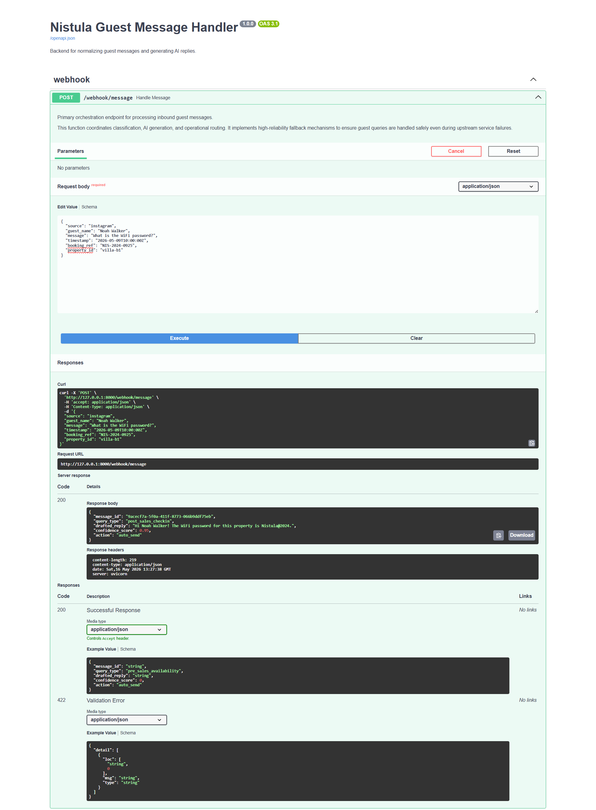

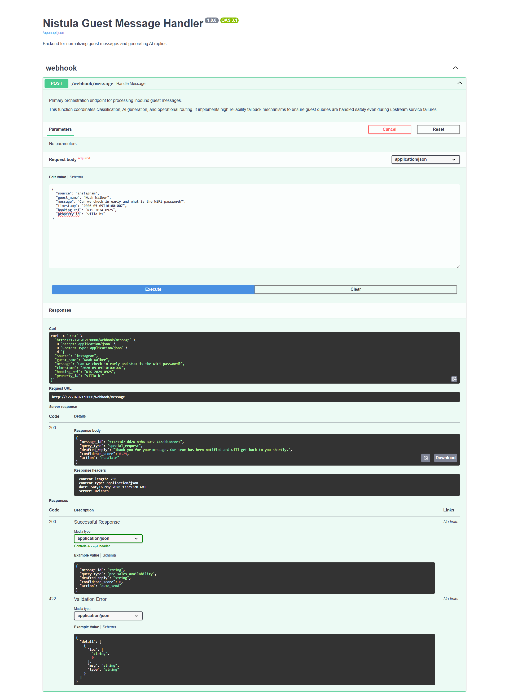

### Path 2: Human Review or Escalation

If the message is ambiguous, sensitive, mixed, or operationally risky, the system does not pretend to know the answer. It returns a conservative reply, lowers confidence, and routes the message to a human or escalates it.

This is especially important for:

- complaints
- refund requests
- special requests
- mixed safe and unsafe intents
- unknown properties
- unclear guest wording

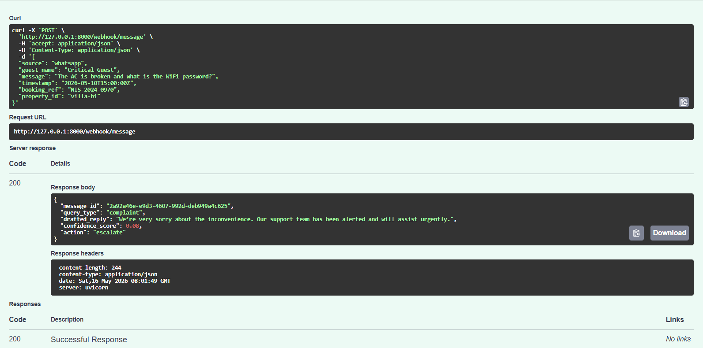

## Confidence Scoring

Confidence scoring is the decision engine that turns a drafted reply into an operational action.

The score is not treated as an AI-only number. It combines Claude's self-reported confidence with deterministic business rules. That matters because a hospitality system should not auto-send just because a language model sounds confident.

### Why Confidence Exists

Different guest messages carry different operational risk.

A WiFi password question is low risk because the answer is static and available in property context. A refund complaint is high risk because the wrong response can create liability, guest dissatisfaction, or operational escalation. The confidence system captures this difference.

### Inputs to the Score

| Signal | Effect | Reason |
| :-- | :-- | :-- |
| Query type | Sets the base confidence | Factual queries start safer than complaints or special requests |
| Claude confidence | Contributes to the final score | Useful signal, but not trusted alone |
| Ambiguity | Reduces confidence | Unclear messages need review |
| Mixed intent | Reduces confidence | A single reply may miss part of the request |
| Refund language | Strongly reduces confidence | Commercial remedies require human judgment |
| Claude failure | Caps confidence | Generic fallbacks should not be auto-sent |
| Deterministic factual fallback | Can raise confidence | The answer comes from verified property context |

### Base Confidence by Query Type

| Query type | Base confidence | Rationale |
| :-- | :-- | :-- |
| `post_sales_checkin` | High | Often factual: WiFi, check-in, check-out |
| `pre_sales_availability` | High | Safe when context contains exact availability |
| `pre_sales_pricing` | Medium-high | Safe for base rate, unsafe for unsupported totals |
| `general_enquiry` | Medium | Depends on the specific question |
| `special_request` | Lower | Usually requires operations confirmation |
| `complaint` | Low | Always escalated |

### Routing Thresholds

| Confidence score | Action |
| :-- | :-- |
| `> 0.85` | `auto_send` |
| `0.60 - 0.85` | `agent_review` |
| `< 0.60` | `escalate` |

Complaints always override the numeric threshold and route to `escalate`.

### Why Generic AI Fallbacks Are Downgraded

When Claude fails, the fallback reply may be polite but not necessarily useful:

```text
Thank you for your message. Our team has been notified and will get back to you shortly.
```

That message should not be auto-sent as if it answered the guest. The system intentionally caps confidence for generic fallbacks and routes low-confidence cases to review or escalation. This is a small but important safety decision: reliability is not just uptime, it is also refusing to automate when the answer is weak.

## Operational Examples

### Complaint Escalation

Complaints are treated as operational events, not normal questions. Even if Claude drafts a good apology, the system still escalates the message so a human can respond and resolve the issue.

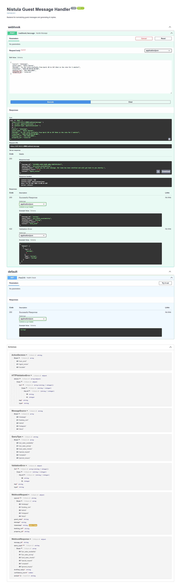

Another complaint example:

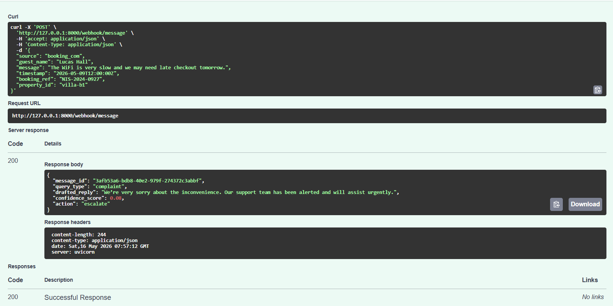

### Pricing and Group Queries

Pricing questions are handled conservatively. The system can classify and route rate questions, but avoids inventing taxes, fees, discounts, or final totals unless those values are explicitly available.

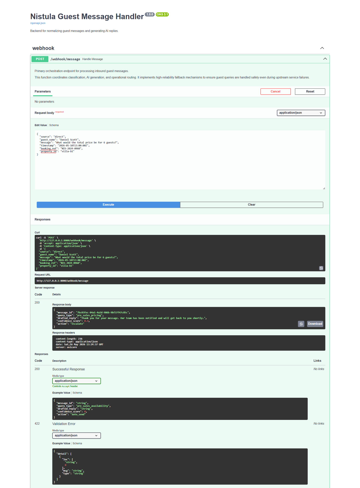

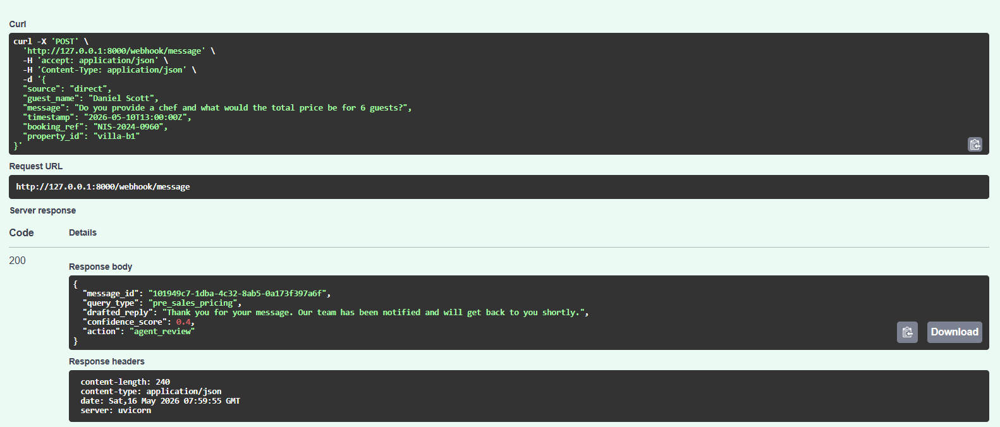

### Human-Like Input

Real guest messages contain typos, shorthand, and casual phrasing. The test suite includes human-like inputs to check whether the classification layer remains useful under imperfect wording.

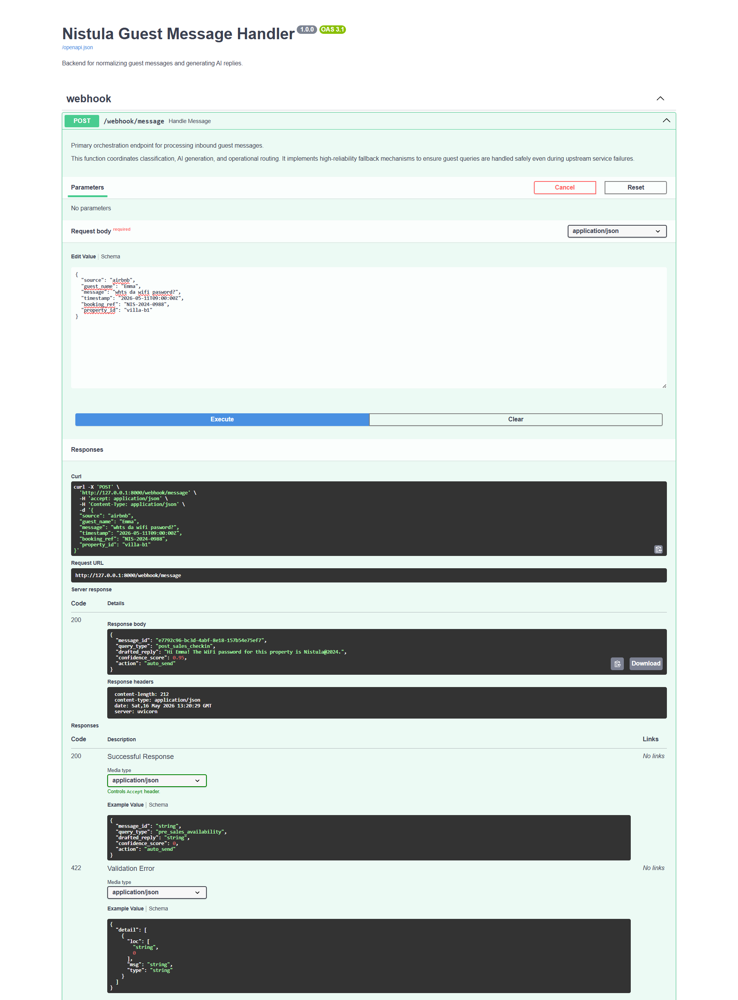

### Validation and Defensive Behavior

The system currently supports the mock property `villa-b1`. Unknown property IDs are rejected early instead of passing "unknown property" into the AI prompt and risking hallucinated context.

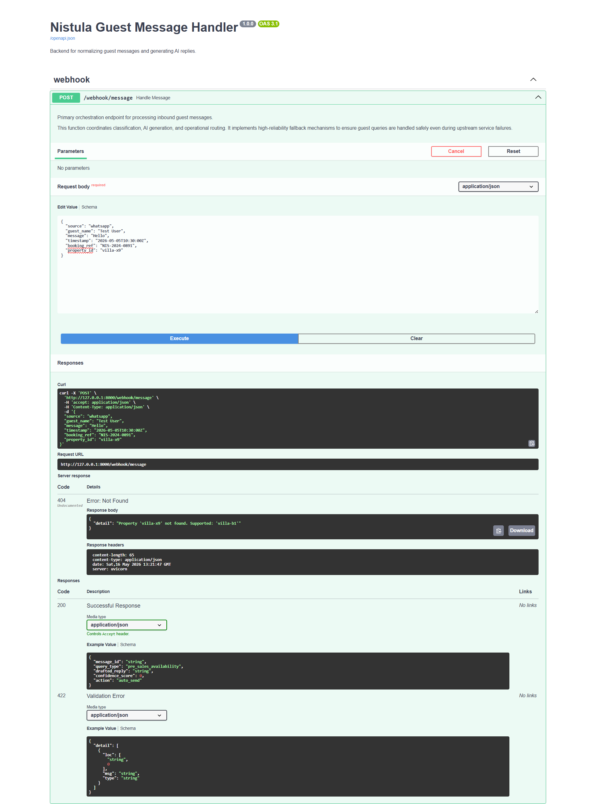

## Observability

Every request gets a generated `message_id`, which is used both in the API response and in logs. This makes it possible to connect:

- inbound request
- classification result
- Claude success or failure
- fallback decision
- confidence score
- final routing action

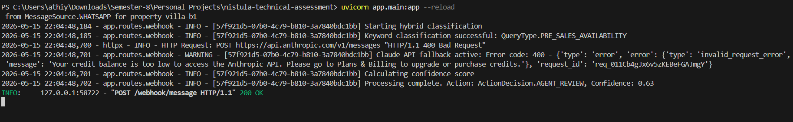

The logging strategy keeps API responses clean while preserving debugging detail internally. For example, a public response does not expose `failure_type`, but logs can still show whether Claude failed due to billing, authentication, timeout, or malformed JSON.

## Automated Testing Strategy

The project includes an operational validation script rather than only unit-style checks. The goal is to simulate how the webhook behaves across realistic guest messages.

Run:

```bash
python tests/sample_requests.py
```

The script prints each request and response, then summarizes action distribution and fallback behavior.

Representative scenarios:

| Scenario | Expected behavior |
| :-- | :-- |
| WiFi password | Deterministic factual answer, `auto_send` |
| Check-in time | Deterministic factual answer, `auto_send` |
| Complaint | `escalate` |
| Refund demand | `escalate` |
| Mixed WiFi and early check-in | Review or escalation, not blind auto-send |
| Unknown property | `404` validation response |
| Missing field | `422` validation response |
| Invalid timestamp | `422` validation response |
| Concurrent requests | Stable request handling with unique IDs |

The fallback-focused script checks specific safety guarantees:

```bash
PYTHONPATH=. python tests/test_fallback.py
```

On Windows PowerShell:

```powershell
$env:PYTHONPATH="."; python tests/test_fallback.py
```

## API Endpoints

| Endpoint | Method | Purpose |
| :-- | :-- | :-- |
| `/webhook/message` | `POST` | Process an inbound guest message |
| `/health` | `GET` | Basic service health check |
| `/docs` | `GET` | Swagger/OpenAPI documentation |

## Error Handling

| Error case | Behavior |
| :-- | :-- |
| Unsupported source | `422` validation error |
| Missing required field | `422` validation error |
| Empty message | `422` validation error |
| Invalid timestamp | `422` validation error |
| Unknown property | `404` with clear detail |
| Claude billing/auth/API failure | Safe fallback path |
| Claude malformed JSON | Safe fallback path |

## PostgreSQL Schema

Part 2 is implemented in:

```text
schema.sql
```

The schema is designed for a unified messaging platform, not just the single webhook demo.

### Design Highlights

| Area | Design |
| :-- | :-- |
| Guest profiles | Central `guests` table |
| Cross-channel identity | `guest_channel_identities` maps platform identities to guests |
| Reservations | Linked to guests and conversations |
| Messages | Unified inbound and outbound `messages` table |
| AI lifecycle | Stores query type, confidence score, AI generated state, agent edits, and action taken |

### Hardest Database Design Decision

The hardest schema decision was guest identity resolution across channels. A naive design would treat `guest_name` as the identity, but that fails quickly in real systems because names are not unique and guests may contact Nistula from different platforms.

The schema separates the person from the platform identity:

- `guests` represents the logical guest.
- `guest_channel_identities` stores WhatsApp, Airbnb, Booking.com, Instagram, or direct identifiers.

This adds some complexity, but it gives the platform a realistic path toward guest merging and cross-channel conversation history without rewriting the core schema.

## Thinking Question

Part 3 is answered in:

```text
thinking.md
```

The answer focuses on the 3am hot-water complaint scenario: immediate guest response, operational escalation, no-response fallback, and longer-term pattern detection after repeated Villa B1 hot-water complaints.

## Key Engineering Tradeoffs

### Rule-Based Classification Plus Claude

Pure AI classification would be flexible but harder to reason about during failures. Pure keyword logic would be reliable but brittle. The hybrid approach keeps obvious cases deterministic while still allowing AI assistance for nuance.

### Conservative Automation

The system is intentionally cautious. It prefers human review over unsafe auto-send when a message is ambiguous, mixed, sensitive, or based on unavailable information.

### Deterministic Fallbacks Instead of Fake AI

When Claude fails, the backend does not pretend the AI succeeded. It either answers from verified context or routes to a human. This makes the system honest and operationally safer.

### Minimal Public Response

The response schema follows the assessment contract exactly. Internal diagnostics stay in logs so API consumers receive a clean response while engineers still get observability.

## Known Limitations

- Only the mock `villa-b1` property context is implemented.
- The system selects one primary query type, even when mixed intent is detected internally.
- There is no persistent database integration in Part 1.
- Guest identity resolution is designed in SQL but not wired into the webhook.
- Pricing handling avoids calculating final totals unless all required values are explicitly available.
- Confidence scoring is heuristic rather than statistically calibrated.

## Future Improvements

Given more time, I would extend the system with:

- persisted conversations and message history
- retrieval of reservation context before drafting
- richer multi-intent response planning
- calibrated confidence scoring from historical agent edits
- incident creation for complaints
- notification workflows for urgent operational issues
- scheduled maintenance signals from repeated complaint patterns

I would avoid adding queues, auth, or microservice infrastructure until the core workflow needs them. For this assessment, the priority is correctness, safety, and readable orchestration.

## Final Notes

This backend is designed around a simple principle: AI can help draft, but the system must own the operational decision.

That is why the implementation emphasizes deterministic safeguards, clean validation, confidence scoring, escalation routing, and graceful degradation. In hospitality messaging, a safe non-answer with human review is often better than a confident automated mistake.
