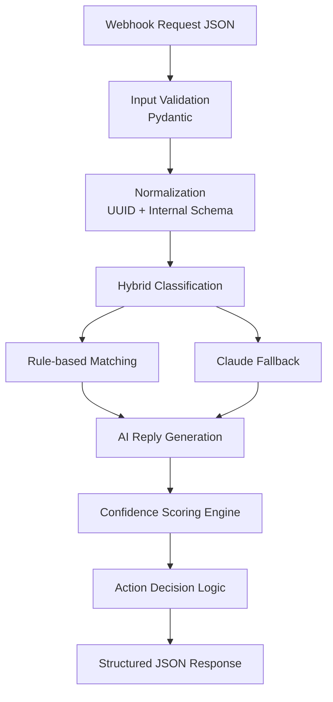

# Nistula-Technical-Assessment

A production-inspired backend system for unified guest messaging, AI-assisted response generation, and operational escalation handling.

This project was built as part of the Nistula technical assessment and focuses on:

* Unified guest message ingestion
* Hybrid AI + deterministic classification
* AI-assisted hospitality replies
* Confidence scoring and escalation logic
* PostgreSQL schema design for scalable messaging workflows

---

# Production-Grade Readability Refactor (May 2026)

The codebase has undergone a comprehensive maintainability refactor to ensure long-term observability and structural clarity. Key enhancements include:
*   **Decoupled Service Architecture**: Logic for classification, AI interaction, and fallback generation is now fully encapsulated in specialized service classes.
*   **Structured Observability**: Standardized logging with correlation IDs, professional docstrings, and internalized diagnostic metadata.
*   **Resilient Fallbacks**: Deterministic, property-aware responses for critical guest queries (WiFi, check-in, pricing, availability) that activate automatically during AI service disruptions.
*   **Strict Escalation Routing**: Precise threshold compliance (Complaints/Low confidence → Escalate) to ensure operational safety.
*   **Self-Documenting API**: Clean, consumer-facing Pydantic models optimized for Swagger/OpenAPI documentation.

---

# Tech Stack

| Layer              | Technology                        |
| :----------------- | :-------------------------------- |
| Backend API        | FastAPI                           |
| AI Integration     | Anthropic Claude API              |
| Validation         | Pydantic                          |
| Database Design    | PostgreSQL                        |
| Environment Config | python-dotenv / pydantic-settings |

---

# Part 1 — Guest Message Handler

## Problem Statement

Nistula receives guest messages from multiple platforms including:

* WhatsApp
* Airbnb
* Booking.com
* Instagram
* Direct channels

The system normalizes inbound messages into a unified internal schema, classifies guest intent, generates AI-assisted replies, and determines whether a response should be automatically sent, reviewed by an agent, or escalated.

---

# Architecture Flow



---

# Design Philosophy

The implementation prioritizes:

* Deterministic business rules
* Graceful degradation
* Operational clarity
* Maintainability
* Human-in-the-loop escalation

The system is intentionally designed to remain operational even if external AI services fail.

---

# Key Features

## Hybrid Classification Engine

The system uses a hybrid classification strategy:

| Approach                  | Purpose                                                        |
| :------------------------ | :------------------------------------------------------------- |
| Rule-based Classification | Fast, deterministic handling for common queries and complaints |
| Claude Fallback           | Handles ambiguous or nuanced guest messages                    |

This balances:

* latency,
* operational reliability,
* and API cost efficiency.

---

## Graceful AI Degradation

A core engineering principle of the project is resilience under partial failure.

If the Claude API becomes unavailable:

* the request still succeeds,
* a safe hospitality fallback response is generated,
* confidence is reduced,
* and the message is routed for human review or escalation.

This prevents guest-facing API failures and ensures operational continuity.

### Graceful AI Failure Handling

The system implements an intelligent fallback strategy to maintain operational safety when the Claude API fails or returns malformed responses.

#### 1. Explicit Failure Detection
The system detects Claude failures (timeouts, API errors, JSON parsing errors) and returns a `success: False` flag. This allows the backend to take deterministic action instead of blindly trusting a generic fallback message.

#### 2. Deterministic Factual Fallbacks
If Claude fails but the guest query is factual (WiFi password, check-in/out times, caretaker availability), the system generates a **backend-owned trusted response** directly from the property context.

*   **Benefit**: Guests get accurate answers to critical operational questions even during AI outages.
*   **Safety**: These responses are generated via templates and string matching against verified property data, eliminating hallucination risk.

#### 3. Operational Safety Safeguards
If Claude fails and no deterministic fallback is available for the query:
*   The system returns a generic hospitality fallback message.
*   **Critical Safeguard**: The confidence score is forced to a low value (0.4), and the action is automatically downgraded to `agent_review` or `escalate`.
*   **Never Auto-Send**: Generic fallback messages are **never** auto-sent to guests, preventing cold, unhelpful automated interactions.

---

## Deterministic Escalation Logic

The backend owns business-critical decisions.

Examples:

* all complaints are escalated,
* refund-related messages reduce confidence,
* factual post-sales queries (WiFi/check-in) are optimized for auto-send.

---

# Confidence Scoring Engine

Confidence scoring combines:

* deterministic heuristics,
* business risk weighting,
* and optional AI confidence signals.

## Confidence Signals

| Signal               | Effect                     |
| :------------------- | :------------------------- |
| Complaint detected   | Heavy confidence reduction |
| Refund request       | Heavy reduction            |
| Ambiguous wording    | Moderate reduction         |
| Known factual query  | Confidence boost           |
| AI fallback response | Confidence reduction       |

---

# Action Thresholds

| Confidence Score | Action         |
| :--------------- | :------------- |
| > 0.85           | `auto_send`    |
| 0.60 – 0.85      | `agent_review` |
| < 0.60           | `escalate`     |

Additionally:

* all complaints are escalated regardless of confidence.

---

# Example API Request

```json
{
  "source": "whatsapp",
  "guest_name": "Rahul Sharma",
  "message": "Is the villa available from April 20 to 24? What is the rate for 2 adults?",
  "timestamp": "2026-05-05T10:30:00Z",
  "booking_ref": "NIS-2024-0891",
  "property_id": "villa-b1"
}
```

---

# Example API Response

```json
{
  "message_id": "7f2a8b3c-...",
  "query_type": "pre_sales_availability",
  "drafted_reply": "Hi Rahul! Great news, Villa B1 is available...",
  "confidence_score": 0.91,
  "action": "auto_send"
}
```

---

# API Endpoints

| Endpoint           | Method | Purpose                        |
| :----------------- | :----- | :----------------------------- |
| `/webhook/message` | POST   | Process inbound guest messages |
| `/docs`            | GET    | Swagger/OpenAPI documentation  |
| `/health`          | GET    | Health check                   |

---

# Project Structure

```text
nistula-technical-assessment/
│
├── app/
│   ├── config/
│   ├── models/
│   ├── routes/
│   ├── schemas/
│   ├── services/
│   └── main.py
│
├── tests/
│   └── sample_requests.py
│
├── schema.sql
├── requirements.txt
├── thinking.md
├── .env.example
└── README.md
```

---

# Setup Instructions

## 1. Install Dependencies

```bash
pip install -r requirements.txt
```

## 2. Configure Environment Variables

Create a `.env` file using `.env.example`

```env
ANTHROPIC_API_KEY=your_api_key_here
```

---

## 3. Run FastAPI Server

```bash
uvicorn app.main:app --reload
```

---

## 4. Open Swagger Docs

```text
http://127.0.0.1:8000/docs
```

---

## 5. Run Sample Tests

```bash
python tests/sample_requests.py
```

---

# Test Scenarios Verified

| Scenario                      | Expected Outcome           |
| :---------------------------- | :------------------------- |
| Availability + Pricing Query  | `agent_review`             |
| Complaint / Operational Issue | `escalate`                 |
| WiFi / Check-in Query         | `auto_send`                |
| Invalid Property ID           | Validation error           |
| Claude API Failure            | Graceful fallback response |

---

# Screenshots

## Swagger Documentation

Interactive FastAPI Swagger/OpenAPI documentation showing:

* webhook endpoints,
* request/response schemas,
* validation models,
* and API testing interface.


---

## Complaint Escalation Example

Example request execution through the `/webhook/message` endpoint demonstrating:

* guest message ingestion,
* hybrid query classification,
* confidence scoring,
* and operational routing (`agent_review` / escalation workflow).


---

## Structured Logging with Correlation IDs

Structured backend logs demonstrating request lifecycle tracing using correlation IDs.

The same UUID is propagated across:

* request ingestion,
* classification,
* Claude fallback handling,
* confidence scoring,
* and final action decision logging.

This improves observability and debugging in production-style systems.


---

# Part 2 — PostgreSQL Database Schema

The repository also includes a production-inspired PostgreSQL schema for the unified messaging platform.

File:

```text
schema.sql
```

---

# Database Design Highlights

## Unified Messaging Model

All inbound and outbound communication is stored in a single `messages` table for:

* auditability,
* analytics,
* escalation tracking,
* and AI performance monitoring.

---

## Guest Identity Resolution

The schema separates:

* logical guest profiles,
* from platform-specific channel identities.

Tables:

* `guests`
* `guest_channel_identities`

This supports future cross-platform identity merging without requiring schema refactoring.

---

## AI Lifecycle Tracking

The schema tracks:

* AI-generated drafts,
* agent edits,
* confidence scores,
* escalation states,
* and action decisions.

This creates a clear operational feedback loop for future AI optimization.

---

# Hardest Design Decision

The most difficult architectural decision was modeling guest identity across multiple communication channels despite weak webhook identifiers.

A naive approach would assume `guest_name` uniqueness, which breaks immediately in real-world systems.

Instead, the schema separates:

* guest identity,
* from source-specific channel identities.

This introduces moderate complexity but provides a scalable path for future identity resolution and guest merging workflows.

---

# Known Limitations

* Only `villa-b1` mock property context is implemented
* Current implementation selects a single primary query type
* No persistent database integration in Part 1
* Guest identity resolution is limited by inbound payload structure
* Confidence scoring uses deterministic heuristics rather than ML calibration

---

# Future Improvements

Potential future extensions include:

* persistent database integration,
* conversation history retrieval,
* async processing queues,
* retrieval-augmented response generation,
* advanced multi-intent classification,
* and automated maintenance/escalation workflows.

---

# Final Notes

This implementation focuses on:

* operational reliability,
* maintainable backend architecture,
* deterministic business safeguards,
* and pragmatic AI-assisted workflows.